# Virtual Boy Waveform Collection
This repository contains a collection of waveforms that can be used when developing Virtual Boy games.
Learn more about how to use them here: https://files.virtual-boy.com/download/978651/stsvb.html#vsu_pcm_waveforms

The waveforms have been collected from various sources (which are stated in the respective files) and converted to the most common formats.
They are available as c code, binary and VuEngine format.
Diagrams have been added to visualize each waveform.

If you want to have your waveforms added you can create PR or contact me on discord: https://discord.com/invite/qvxTuRB


If you want to support my work you can do so here: https://www.patreon.com/thunderstruckProjects


# BH_GLOCKEN waveform

## Info

This waveform has been extracted from the game Bound High!. You can find infos here: https://www.virtual-boy.com/games/bound-high/

## Data (Hex) 

```
20-35-26-2D-32-19-1D-2A
24-30-3E-2E-25-21-17-18
20-28-29-1F-1C-12-02-10
1C-16-23-27-0F-13-1A-0B
```
## Data (Int) 

```
32-53-38-45-50-25-29-42
36-48-62-46-37-33-23-24
32-40-41-31-28-18-02-16
28-22-35-39-15-19-26-11
```
## Diagram (Low Resolution) 

```
          ##                    
          ##                    
 ##       ##                    
 ## ##   ###                    
 #####   # ##                   
 ### # ###  #    ###            
 ### # ###  ##   # #       ##   
##   # #     ## ## #      ###   
     ###      # #  ###  ### #   
     ##       ###    #  ### # ##
              ##     #  ### # ##
                     ####   ####
                      ##    ## #
                      ##       #
                      ##        
                      ##        
```

## Diagram (Full Resolution) 

```
                                
          ##                    
          ##                    
          ##                    
          ##                    
          ##                    
          ##                    
          ##                    
          ##                    
          ##                    
 ##       ##                    
 ##       ##                    
 ##       ##                    
 ## ##    ##                    
 ## ##    ##                    
 ## ##   ###                    
 ## ##   # #                    
 ## ##   # ##                   
 #####   #  #                   
 ### #   #  #                   
 ### #   #  #                   
 ### # ###  #                   
 ### # ###  #     ##            
 ### # ###  #    ###            
 ### # ###  #    # #       ##   
 ### # ###  #    # #       ##   
 #   # ###  ##   # #       ##   
 #   # ###   #   # #       ##   
 #   # #     #   # #      ###   
 #   # #     #   # #      # #   
 #   # #     ##  # #      # #   
##   # #      # ## #      # #   
     # #      # #  ##     # #   
     # #      # #   #     # #   
     ###      # #   #     # #   
     ##       # #   ##  ### #   
     ##       # #    #  ### #   
     ##       # #    #  ### # ##
     ##       # #    #  ### # ##
              ###    #  ### # ##
              ##     #  ### # ##
                     #  ### # ##
                     #  #   # ##
                     #  #   # ##
                     #  #   ####
                     ## #   ## #
                      # #   ## #
                      ###   ## #
                      ##    ## #
                      ##       #
                      ##       #
                      ##       #
                      ##       #
                      ##        
                      ##        
                      ##        
                      ##        
                      ##        
                      ##        
                      ##        
                      ##        
                      ##        
                                
                                
```

## Diagram (Bitmap) 


# BH_ORGAN waveform

## Info

This waveform has been extracted from the game Bound High!. You can find infos here: https://www.virtual-boy.com/games/bound-high/

## Data (Hex) 

```
20-3F-38-38-27-23-27-11
13-26-0C-26-23-22-1E-00
20-3F-23-1E-1E-1A-35-1A
2C-2F-1A-1D-1A-08-09-00
```
## Data (Int) 

```
32-63-56-56-39-35-39-17
19-38-12-38-35-34-30-00
32-63-35-30-30-26-53-26
44-47-26-29-26-08-09-00
```
## Diagram (Low Resolution) 

```
 ##              ##             
 ####            ##             
 #  #            ##   ##        
 #  #            ##   ##        
 #  #            ##   #####     
 #  #            ##   ### #     
 #  #### ####    ##   ### #     
##   ### ###### ####  ### #     
       # ###  ###  ###### ###   
       # ###   ##    #### ####  
       # ###   ##            #  
       #####   ##            #  
          ##   ##            #  
               ##            ###
               ##              #
               ##              #
```

## Diagram (Full Resolution) 

```
 ##              ##             
 ##              ##             
 ##              ##             
 ##              ##             
 ##              ##             
 ##              ##             
 ##              ##             
 ####            ##             
 #  #            ##             
 #  #            ##             
 #  #            ##   ##        
 #  #            ##   ##        
 #  #            ##   ##        
 #  #            ##   ##        
 #  #            ##   ##        
 #  #            ##   ##        
 #  #            ##   ## ##     
 #  #            ##   ## ##     
 #  #            ##   ## ##     
 #  #            ##   #####     
 #  #            ##   ### #     
 #  #            ##   ### #     
 #  #            ##   ### #     
 #  #            ##   ### #     
 #  ####         ##   ### #     
 #   ### ####    ##   ### #     
 #   ### ####    ##   ### #     
 #   ### ####    ##   ### #     
 #   ### #####   ###  ### #     
 #     # ### ##  # #  ### #     
 #     # ###  #  # #  ### #     
##     # ###  # ## #  ### #     
       # ###  # #  #  ### #     
       # ###  ###  ###### #     
       # ###   ##    #### ###   
       # ###   ##    #### ###   
       # ###   ##    #### ###   
       # ###   ##    #### ####  
       # ###   ##            #  
       # ###   ##            #  
       # ###   ##            #  
       # ###   ##            #  
       # ###   ##            #  
       # ###   ##            #  
       #####   ##            #  
       ## ##   ##            #  
       ## ##   ##            #  
          ##   ##            #  
          ##   ##            #  
          ##   ##            #  
          ##   ##            #  
          ##   ##            #  
               ##            #  
               ##            #  
               ##            ###
               ##            ###
               ##              #
               ##              #
               ##              #
               ##              #
               ##              #
               ##              #
               ##              #
               ##              #
```

## Diagram (Bitmap) 


# BH_SAW waveform

## Info

This waveform has been extracted from the game Bound High!. You can find infos here: https://www.virtual-boy.com/games/bound-high/

## Data (Hex) 

```
01-03-05-07-09-0B-0D-0F
31-13-15-17-19-1B-1D-1F
21-23-25-27-29-2B-2D-2F
11-33-35-37-39-3B-3D-3F
```
## Data (Int) 

```
01-03-05-07-09-11-13-15
49-19-21-23-25-27-29-31
33-35-37-39-41-43-45-47
17-51-53-55-57-59-61-63
```
## Diagram (Low Resolution) 

```
                              ##
                            ### 
                          ###   
        ##               ##     
        ##            ####      
        ##          ### ##      
        ##        ###   ##      
        ##      ###     ##      
        ##    ###       ##      
        ##  ###         ##      
        #####           ##      
        ###             ##      
      ###                       
    ###                         
  ###                           
###                             
```

## Diagram (Full Resolution) 

```
                               #
                               #
                              ##
                              # 
                             ## 
                             #  
                            ##  
                            #   
                           ##   
                           #    
                          ##    
                          #     
                         ##     
                         #      
        ##               #      
        ##               #      
        ##             ###      
        ##             ###      
        ##            ####      
        ##            # ##      
        ##           ## ##      
        ##           #  ##      
        ##          ##  ##      
        ##          #   ##      
        ##         ##   ##      
        ##         #    ##      
        ##        ##    ##      
        ##        #     ##      
        ##       ##     ##      
        ##       #      ##      
        ##      ##      ##      
        ##      #       ##      
        ##     ##       ##      
        ##     #        ##      
        ##    ##        ##      
        ##    #         ##      
        ##   ##         ##      
        ##   #          ##      
        ##  ##          ##      
        ##  #           ##      
        ## ##           ##      
        ## #            ##      
        ####            ##      
        ###             ##      
        ###             ##      
        #               ##      
        #               ##      
        #                       
       ##                       
       #                        
      ##                        
      #                         
     ##                         
     #                          
    ##                          
    #                           
   ##                           
   #                            
  ##                            
  #                             
 ##                             
 #                              
##                              
                                
```

## Diagram (Bitmap) 


# BH_SAW_SQARE waveform

## Info

This waveform has been extracted from the game Bound High!. You can find infos here: https://www.virtual-boy.com/games/bound-high/

## Data (Hex) 

```
00-00-00-00-00-00-00-00
00-00-00-00-08-10-18-20
28-30-38-3F-3F-3F-3F-3F
3F-3F-3F-3F-3F-3F-3F-3F
```
## Data (Int) 

```
00-00-00-00-00-00-00-00
00-00-00-00-08-16-24-32
40-48-56-63-63-63-63-63
63-63-63-63-63-63-63-63
```
## Diagram (Low Resolution) 

```
                   #############
                  ##            
                  #             
                 ##             
                 #              
                ##              
                #               
               ##               
               #                
              ##                
              #                 
             ##                 
             #                  
            ##                  
            #                   
#############                   
```

## Diagram (Full Resolution) 

```
                   #############
                   #            
                   #            
                   #            
                   #            
                   #            
                   #            
                  ##            
                  #             
                  #             
                  #             
                  #             
                  #             
                  #             
                  #             
                 ##             
                 #              
                 #              
                 #              
                 #              
                 #              
                 #              
                 #              
                ##              
                #               
                #               
                #               
                #               
                #               
                #               
                #               
               ##               
               #                
               #                
               #                
               #                
               #                
               #                
               #                
              ##                
              #                 
              #                 
              #                 
              #                 
              #                 
              #                 
              #                 
             ##                 
             #                  
             #                  
             #                  
             #                  
             #                  
             #                  
             #                  
            ##                  
            #                   
            #                   
            #                   
            #                   
            #                   
            #                   
            #                   
#############                   
```

## Diagram (Bitmap) 


# BH_SINE_ALPHA waveform

## Info

This waveform has been extracted from the game Bound High!. You can find infos here: https://www.virtual-boy.com/games/bound-high/

## Data (Hex) 

```
20-29-30-33-33-31-31-35
39-3E-3E-3A-33-2A-23-20
20-20-1D-16-0E-06-02-02
06-0B-0F-0F-0E-0D-10-17
```
## Data (Int) 

```
32-41-48-51-51-49-49-53
57-62-62-58-51-42-35-32
32-32-29-22-14-06-02-02
06-11-15-15-14-13-16-23
```
## Diagram (Low Resolution) 

```
         ###                    
        ## ##                   
       ##   #                   
  ######    ##                  
  #          #                  
 ##          ##                 
 #            #                 
##            #####             
                  ##            
                   #            
                   ##          #
                    #         ##
                    ##    ##### 
                     #   ##     
                     ## ##      
                      ###       
```

## Diagram (Full Resolution) 

```
                                
         ###                    
         # #                    
         # #                    
         # #                    
         # ##                   
        ##  #                   
        #   #                   
        #   #                   
        #   #                   
       ##   #                   
       #    #                   
   ### #    ##                  
   # # #     #                  
   # ###     #                  
  ##         #                  
  #          #                  
  #          #                  
  #          #                  
  #          #                  
  #          #                  
  #          ##                 
 ##           #                 
 #            #                 
 #            #                 
 #            #                 
 #            #                 
 #            #                 
 #            ##                
 #             #                
 #             #                
##             ####             
                  #             
                  #             
                  ##            
                   #            
                   #            
                   #            
                   #            
                   #            
                   #           #
                   ##          #
                    #          #
                    #          #
                    #          #
                    #          #
                    #          #
                    #         ##
                    #     ### # 
                    ##    # ### 
                     #    #  ## 
                     #    #     
                     #   ##     
                     #   #      
                     #   #      
                     #   #      
                     #   #      
                     ## ##      
                      # #       
                      # #       
                      # #       
                      ###       
                                
                                
```

## Diagram (Bitmap) 

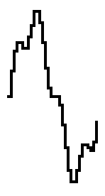


# BH_SQUARE waveform

## Info

This waveform has been extracted from the game Bound High!. You can find infos here: https://www.virtual-boy.com/games/bound-high/

## Data (Hex) 

```
26-19-00-00-00-00-00-00
00-00-00-00-00-00-00-00
1B-2A-3F-3F-3F-3F-3F-3F
3F-3F-3F-3F-3F-3F-3F-3F
```
## Data (Int) 

```
38-25-00-00-00-00-00-00
00-00-00-00-00-00-00-00
27-42-63-63-63-63-63-63
63-63-63-63-63-63-63-63
```
## Diagram (Low Resolution) 

```
                  ##############
                  #             
                  #             
                  #             
                  #             
                 ##             
##               #              
 #               #              
 #               #              
 ##             ##              
  #             #               
  #             #               
  #             #               
  #             #               
  #             #               
  ###############               
```

## Diagram (Full Resolution) 

```
                  ##############
                  #             
                  #             
                  #             
                  #             
                  #             
                  #             
                  #             
                  #             
                  #             
                  #             
                  #             
                  #             
                  #             
                  #             
                  #             
                  #             
                  #             
                  #             
                  #             
                  #             
                 ##             
                 #              
                 #              
                 #              
##               #              
 #               #              
 #               #              
 #               #              
 #               #              
 #               #              
 #               #              
 #               #              
 #               #              
 #               #              
 #               #              
 #              ##              
 #              #               
 ##             #               
  #             #               
  #             #               
  #             #               
  #             #               
  #             #               
  #             #               
  #             #               
  #             #               
  #             #               
  #             #               
  #             #               
  #             #               
  #             #               
  #             #               
  #             #               
  #             #               
  #             #               
  #             #               
  #             #               
  #             #               
  #             #               
  #             #               
  #             #               
  #             #               
  ###############               
```

## Diagram (Bitmap) 


# BH_SQUARE_75_DUTY waveform

## Info

This waveform has been extracted from the game Bound High!. You can find infos here: https://www.virtual-boy.com/games/bound-high/

## Data (Hex) 

```
26-19-00-00-00-00-00-00
00-00-00-00-00-00-00-00
00-00-00-00-00-00-00-00
1B-2A-3F-3F-3F-3F-3F-3F
```
## Data (Int) 

```
38-25-00-00-00-00-00-00
00-00-00-00-00-00-00-00
00-00-00-00-00-00-00-00
27-42-63-63-63-63-63-63
```
## Diagram (Low Resolution) 

```
                          ######
                          #     
                          #     
                          #     
                          #     
                         ##     
##                       #      
 #                       #      
 #                       #      
 ##                     ##      
  #                     #       
  #                     #       
  #                     #       
  #                     #       
  #                     #       
  #######################       
```

## Diagram (Full Resolution) 

```
                          ######
                          #     
                          #     
                          #     
                          #     
                          #     
                          #     
                          #     
                          #     
                          #     
                          #     
                          #     
                          #     
                          #     
                          #     
                          #     
                          #     
                          #     
                          #     
                          #     
                          #     
                         ##     
                         #      
                         #      
                         #      
##                       #      
 #                       #      
 #                       #      
 #                       #      
 #                       #      
 #                       #      
 #                       #      
 #                       #      
 #                       #      
 #                       #      
 #                       #      
 #                      ##      
 #                      #       
 ##                     #       
  #                     #       
  #                     #       
  #                     #       
  #                     #       
  #                     #       
  #                     #       
  #                     #       
  #                     #       
  #                     #       
  #                     #       
  #                     #       
  #                     #       
  #                     #       
  #                     #       
  #                     #       
  #                     #       
  #                     #       
  #                     #       
  #                     #       
  #                     #       
  #                     #       
  #                     #       
  #                     #       
  #                     #       
  #######################       
```

## Diagram (Bitmap) 

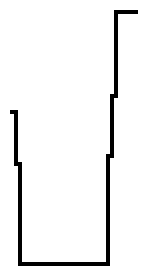


# GCCVB_PIANO waveform

## Info

This waveform has been found in libgccvb. You can find it here: https://github.com/VUEngine/libgccvb

## Data (Hex) 

```
1F-1C-1E-2D-31-22-1B-1C
1B-19-1B-29-2C-2E-32-2F
39-3D-32-2B-21-24-21-18
14-20-21-13-1A-15-14-1D
```
## Data (Int) 

```
31-28-30-45-49-34-27-28
27-25-27-41-44-46-50-47
57-61-50-43-33-36-33-24
20-32-33-19-26-21-20-29
```
## Diagram (Low Resolution) 

```
                 ##             
                ###             
                # #             
    ##        ### ##            
   ###      #####  #            
   # #     ##      ##           
   # #     #        ###         
   # ##    #        #### ###    
####  ###  #           # # #   #
      ######           ### ### #
                        ## #####
                           ##   
                                
                                
                                
                                
```

## Diagram (Full Resolution) 

```
                                
                                
                 ##             
                 ##             
                 ##             
                 ##             
                ###             
                # #             
                # #             
                # #             
                # #             
                # #             
                # #             
              ### ##            
    ##        ###  #            
    ##        ###  #            
    ##        ###  #            
    ##       ##    #            
   ###       #     #            
   # #      ##     #            
   # #      #      ##           
   # #      #       #           
   # #     ##       #           
   # #     #        #           
   # #     #        #           
   # #     #        #           
   # #     #        #           
   # #     #        ###         
   # #     #        ###         
   # ##    #        ###         
   #  #    #        ####  ##    
   #  #    #           # ###    
## #  #    #           # # #    
 ###  #    #           # # #    
 ##   #    #           # # #   #
 ##   ###  #           # # #   #
      ######           # # #   #
         ##            # # ### #
         ##            # # ### #
                       ### ### #
                        ## ### #
                        ## ### #
                        ## #####
                        ## ## ##
                           ##   
                                
                                
                                
                                
                                
                                
                                
                                
                                
                                
                                
                                
                                
                                
                                
                                
                                
                                
                                
```

## Diagram (Bitmap) 

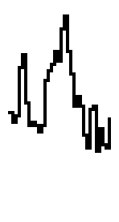


# GCCVB_SAWTOOTH waveform

## Info

This waveform has been found in libgccvb. You can find it here: https://github.com/VUEngine/libgccvb

## Data (Hex) 

```
00-02-04-06-08-0A-0C-0E
10-12-14-16-18-1A-1C-1E
20-22-24-26-28-2A-2C-2E
30-32-34-36-38-3A-3C-3E
```
## Data (Int) 

```
00-02-04-06-08-10-12-14
16-18-20-22-24-26-28-30
32-34-36-38-40-42-44-46
48-50-52-54-56-58-60-62
```
## Diagram (Low Resolution) 

```
                              ##
                            ### 
                          ###   
                        ###     
                      ###       
                    ###         
                  ###           
                ###             
              ###               
            ###                 
          ###                   
        ###                     
      ###                       
    ###                         
  ###                           
###                             
```

## Diagram (Full Resolution) 

```
                                
                               #
                               #
                              ##
                              # 
                             ## 
                             #  
                            ##  
                            #   
                           ##   
                           #    
                          ##    
                          #     
                         ##     
                         #      
                        ##      
                        #       
                       ##       
                       #        
                      ##        
                      #         
                     ##         
                     #          
                    ##          
                    #           
                   ##           
                   #            
                  ##            
                  #             
                 ##             
                 #              
                ##              
                #               
               ##               
               #                
              ##                
              #                 
             ##                 
             #                  
            ##                  
            #                   
           ##                   
           #                    
          ##                    
          #                     
         ##                     
         #                      
        ##                      
        #                       
       ##                       
       #                        
      ##                        
      #                         
     ##                         
     #                          
    ##                          
    #                           
   ##                           
   #                            
  ##                            
  #                             
 ##                             
 #                              
##                              
```

## Diagram (Bitmap) 


# GCCVB_SINE waveform

## Info

This waveform has been found in libgccvb. You can find it here: https://github.com/VUEngine/libgccvb

## Data (Hex) 

```
1F-25-2B-30-35-39-3C-3E
3E-3E-3C-39-35-30-2B-25
1F-18-12-0D-08-04-01-00
00-00-02-05-09-0E-13-19
```
## Data (Int) 

```
31-37-43-48-53-57-60-62
62-62-60-57-53-48-43-37
31-24-18-13-08-04-01-00
00-00-02-05-09-14-19-25
```
## Diagram (Low Resolution) 

```
      ######                    
     ##    ##                   
    ##      ##                  
   ##        ##                 
   #          #                 
  ##          ##                
 ##            ##               
 #              #               
##              ##              
                 ##            #
                  #            #
                  ##          ##
                   ##        ## 
                    ##      ##  
                     ##    ##   
                      ######    
```

## Diagram (Full Resolution) 

```
                                
       ####                     
       #  #                     
      ##  ##                    
      #    #                    
      #    #                    
     ##    ##                   
     #      #                   
     #      #                   
     #      #                   
    ##      ##                  
    #        #                  
    #        #                  
    #        #                  
    #        #                  
   ##        ##                 
   #          #                 
   #          #                 
   #          #                 
   #          #                 
  ##          ##                
  #            #                
  #            #                
  #            #                
  #            #                
  #            #                
 ##            ##               
 #              #               
 #              #               
 #              #               
 #              #               
 #              #               
##              ##              
                 #              
                 #              
                 #              
                 #              
                 #              
                 #             #
                 ##            #
                  #            #
                  #            #
                  #            #
                  #            #
                  #           ##
                  ##          # 
                   #          # 
                   #          # 
                   #          # 
                   #         ## 
                   ##        #  
                    #        #  
                    #        #  
                    #        #  
                    #       ##  
                    ##      #   
                     #      #   
                     #      #   
                     #     ##   
                     ##    #    
                      #    #    
                      #   ##    
                      ##  #     
                       ####     
```

## Diagram (Bitmap) 


# GCCVB_SQUARE waveform

## Info

This waveform has been found in libgccvb. You can find it here: https://github.com/VUEngine/libgccvb

## Data (Hex) 

```
00-00-00-00-00-00-00-00
00-00-00-00-00-00-00-00
3E-3E-3E-3E-3E-3E-3E-3E
3E-3E-3E-3E-3E-3E-3E-3E
```
## Data (Int) 

```
00-00-00-00-00-00-00-00
00-00-00-00-00-00-00-00
62-62-62-62-62-62-62-62
62-62-62-62-62-62-62-62
```
## Diagram (Low Resolution) 

```
                ################
                #               
                #               
                #               
                #               
                #               
                #               
                #               
                #               
                #               
                #               
                #               
                #               
                #               
                #               
#################               
```

## Diagram (Full Resolution) 

```
                                
                ################
                #               
                #               
                #               
                #               
                #               
                #               
                #               
                #               
                #               
                #               
                #               
                #               
                #               
                #               
                #               
                #               
                #               
                #               
                #               
                #               
                #               
                #               
                #               
                #               
                #               
                #               
                #               
                #               
                #               
                #               
                #               
                #               
                #               
                #               
                #               
                #               
                #               
                #               
                #               
                #               
                #               
                #               
                #               
                #               
                #               
                #               
                #               
                #               
                #               
                #               
                #               
                #               
                #               
                #               
                #               
                #               
                #               
                #               
                #               
                #               
                #               
#################               
```

## Diagram (Bitmap) 

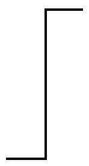


# GCCVB_TRIANGLE waveform

## Info

This waveform has been found in libgccvb. You can find it here: https://github.com/VUEngine/libgccvb

## Data (Hex) 

```
00-04-08-0C-10-14-18-1C
1F-23-27-2B-2F-33-37-3B
3E-3A-36-32-2E-2A-26-22
1F-1B-17-13-0F-0B-07-03
```
## Data (Int) 

```
00-04-08-12-16-20-24-28
31-35-39-43-47-51-55-59
62-58-54-50-46-42-38-34
31-27-23-19-15-11-07-03
```
## Diagram (Low Resolution) 

```
                ##              
               ####             
              ##  ##            
             ##    ##           
            ##      ##          
           ##        ##         
          ##          ##        
         ##            ##       
       ###              ##      
      ##                 ##     
     ##                   ##    
    ##                     ##   
   ##                       ##  
  ##                         ## 
 ##                           ##
##                             #
```

## Diagram (Full Resolution) 

```
                                
                ##              
                ##              
                ##              
               ###              
               # ##             
               #  #             
               #  #             
              ##  #             
              #   ##            
              #    #            
              #    #            
             ##    #            
             #     ##           
             #      #           
             #      #           
            ##      #           
            #       ##          
            #        #          
            #        #          
           ##        #          
           #         ##         
           #          #         
           #          #         
          ##          #         
          #           ##        
          #            #        
          #            #        
         ##            #        
         #             ##       
         #              #       
         #              #       
        ##              ##      
        #                #      
        #                #      
       ##                #      
       #                 ##     
       #                  #     
       #                  #     
      ##                  #     
      #                   ##    
      #                    #    
      #                    #    
     ##                    #    
     #                     ##   
     #                      #   
     #                      #   
    ##                      #   
    #                       ##  
    #                        #  
    #                        #  
   ##                        #  
   #                         ## 
   #                          # 
   #                          # 
  ##                          # 
  #                           ##
  #                            #
  #                            #
 ##                            #
 #                             #
 #                              
 #                              
##                              
```

## Diagram (Bitmap) 


# GCCVB_TRUMPET waveform

## Info

This waveform has been found in libgccvb. You can find it here: https://github.com/VUEngine/libgccvb

## Data (Hex) 

```
26-25-23-20-20-23-23-21
1E-22-26-27-26-22-20-27
25-10-00-28-2A-23-1F-1E
1E-21-25-22-20-22-25-27
```
## Data (Int) 

```
38-37-35-32-32-35-35-33
30-34-38-39-38-34-32-39
37-16-00-40-42-35-31-30
30-33-37-34-32-34-37-39
```
## Diagram (Low Resolution) 

```
                                
                                
                                
                                
                                
                   ###          
###       #### ### # #    ##  ##
  #########  ### # # ##  ###### 
        ##       # #  ####      
                 # #            
                 # #            
                 ###            
                  ##            
                  ##            
                  ##            
                  ##            
```

## Diagram (Full Resolution) 

```
                                
                                
                                
                                
                                
                                
                                
                                
                                
                                
                                
                                
                                
                                
                                
                                
                                
                                
                                
                                
                                
                    ##          
                    ##          
                   ###          
           ##  ##  # #         #
##        #### ##  # #         #
 ##       #  # ### # #    ##  ##
  #       #  # # # # #    ##  # 
  ## ###  #  # # # # ##   ##  # 
   # # # ##  ### # #  #   ##### 
   # # ###    ## # #  #  ## ##  
   ###  ##    ## # #  #  #  ##  
        ##       # #  ## #      
        ##       # #   ###      
                 # #            
                 # #            
                 # #            
                 # #            
                 # #            
                 # #            
                 # #            
                 # #            
                 # #            
                 # #            
                 # #            
                 # #            
                 # #            
                 ###            
                  ##            
                  ##            
                  ##            
                  ##            
                  ##            
                  ##            
                  ##            
                  ##            
                  ##            
                  ##            
                  ##            
                  ##            
                  ##            
                  ##            
                  ##            
                  ##            
```

## Diagram (Bitmap) 


# GCCVB_VIOLIN waveform

## Info

This waveform has been found in libgccvb. You can find it here: https://github.com/VUEngine/libgccvb

## Data (Hex) 

```
01-12-25-26-13-1A-1C-1D
04-00-13-01-17-1A-10-30
31-32-3D-31-36-3B-26-20
1E-33-3E-33-37-36-29-0F
```
## Data (Int) 

```
01-18-37-38-19-26-28-29
04-00-19-01-23-26-16-48
49-50-61-49-54-59-38-32
30-51-62-51-55-54-41-15
```
## Diagram (Low Resolution) 

```
                  ##      ##    
                  ## ##   ##    
                  #####   ##### 
               ###### #  #### # 
               #      #  #    # 
               #      #  #    ##
  ###          #      ## #     #
  # #          #       ###     #
  # # ###      #        ##     #
  # ### #    ###               #
  # ##  #   ####               #
 ## ##  # ### ##               #
 #      # ###                  #
 #      # ###                   
 #      #####                   
##       ####                   
```

## Diagram (Full Resolution) 

```
                                
                          ##    
                  ##      ##    
                  ##      ##    
                  ## ##   ##    
                  ## ##   ##    
                  ## ##   ##    
                  ## ##   ##    
                  ## ##   ####  
                  #####   ##### 
                  ### #   ### # 
                  ### #   ### # 
                  ### #  #### # 
                 #### #  #    # 
                ## ## #  #    # 
               ##     #  #    # 
               #      #  #    # 
               #      #  #    # 
               #      #  #    # 
               #      #  #    # 
               #      #  #    # 
               #      #  #    # 
               #      #  #    ##
               #      #  #     #
               #      #  #     #
   ##          #      ## #     #
  ###          #       # #     #
  # #          #       # #     #
  # #          #       # #     #
  # #          #       # #     #
  # #          #       # #     #
  # #          #       ###     #
  # #          #        ##     #
  # #          #        ##     #
  # #  ##      #               #
  # # ###      #               #
  # # # #      #               #
  # ### #    ###               #
  # ##  #    ###               #
  # ##  #    ###               #
  # ##  #   ####               #
  # ##  #   # ##               #
  # ##  #   # ##               #
  # ##  #   # ##               #
  # ##  # ### ##               #
 ##     # ### ##               #
 #      # ### ##               #
 #      # ### ##               #
 #      # ###                  #
 #      # ###                   
 #      # ###                   
 #      # ###                   
 #      # ###                   
 #      # ###                   
 #      # ###                   
 #      # ###                   
 #      # ###                   
 #      # ###                   
 #      # ###                   
 #      #####                   
 #       ####                   
 #       ####                   
##       ####                   
         ##                     
```

## Diagram (Bitmap) 

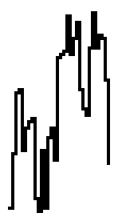


# VBEAT_DELTAPEAK waveform

## Info

This waveform has been found in the VBeat project. You can find it here: https://github.com/enthusi/VBeat

## Data (Hex) 

```
00-00-00-00-00-00-00-00
00-00-00-00-00-00-00-00
3F-00-00-00-00-00-00-00
00-00-00-00-00-00-00-00
```
## Data (Int) 

```
00-00-00-00-00-00-00-00
00-00-00-00-00-00-00-00
63-00-00-00-00-00-00-00
00-00-00-00-00-00-00-00
```
## Diagram (Low Resolution) 

```
                ##              
                ##              
                ##              
                ##              
                ##              
                ##              
                ##              
                ##              
                ##              
                ##              
                ##              
                ##              
                ##              
                ##              
                ##              
################################
```

## Diagram (Full Resolution) 

```
                ##              
                ##              
                ##              
                ##              
                ##              
                ##              
                ##              
                ##              
                ##              
                ##              
                ##              
                ##              
                ##              
                ##              
                ##              
                ##              
                ##              
                ##              
                ##              
                ##              
                ##              
                ##              
                ##              
                ##              
                ##              
                ##              
                ##              
                ##              
                ##              
                ##              
                ##              
                ##              
                ##              
                ##              
                ##              
                ##              
                ##              
                ##              
                ##              
                ##              
                ##              
                ##              
                ##              
                ##              
                ##              
                ##              
                ##              
                ##              
                ##              
                ##              
                ##              
                ##              
                ##              
                ##              
                ##              
                ##              
                ##              
                ##              
                ##              
                ##              
                ##              
                ##              
                ##              
################################
```

## Diagram (Bitmap) 


# VBEAT_FLUTE waveform

## Info

This waveform has been found in the VBeat project. You can find it here: https://github.com/enthusi/VBeat

## Data (Hex) 

```
06-0A-12-17-1B-1A-18-15
10-0D-0A-09-0B-0F-14-18
1E-28-30-37-3D-3E-3D-3B
37-32-2A-21-18-0C-07-04
```
## Data (Int) 

```
06-10-18-23-27-26-24-21
16-13-10-09-11-15-20-24
30-40-48-55-61-62-61-59
55-50-42-33-24-12-07-04
```
## Diagram (Low Resolution) 

```
                    ####        
                    #  ##       
                   ##   ##      
                  ##     ##     
                  #       #     
                 ##       ##    
                 #         #    
                 #         ##   
                ##          #   
    ####       ##           ##  
   ##  ##     ##             #  
  ##    ##    #              #  
  #      ##  ##              ## 
 ##       ####                # 
##                            ##
                                
```

## Diagram (Full Resolution) 

```
                                
                     ##         
                    ####        
                    #  #        
                    #  ##       
                    #   #       
                    #   #       
                    #   #       
                   ##   ##      
                   #     #      
                   #     #      
                   #     #      
                   #     #      
                   #     ##     
                   #      #     
                  ##      #     
                  #       #     
                  #       #     
                  #       #     
                  #       #     
                  #       #     
                  #       ##    
                  #        #    
                 ##        #    
                 #         #    
                 #         #    
                 #         #    
                 #         #    
                 #         #    
                 #         #    
                 #         ##   
                 #          #   
                 #          #   
                ##          #   
                #           #   
                #           #   
    ##          #           #   
    ###         #           #   
    # #         #           #   
    # ##       ##           ##  
   ##  #       #             #  
   #   #       #             #  
   #   ##      #             #  
   #    #     ##             #  
   #    #     #              #  
  ##    #     #              #  
  #     #     #              #  
  #     ##    #              #  
  #      #   ##              #  
  #      #   #               #  
  #      ##  #               #  
  #       #  #               ## 
  #       # ##                # 
 ##       ###                 # 
 #         ##                 # 
 #                            # 
 #                            ##
##                             #
                               #
                               #
                                
                                
                                
                                
```

## Diagram (Bitmap) 

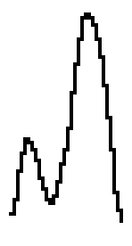


# VBEAT_SAW waveform

## Info

This waveform has been found in the VBeat project. You can find it here: https://github.com/enthusi/VBeat

## Data (Hex) 

```
00-02-04-06-08-0A-0D-0F
11-13-15-17-1A-1C-1E-20
22-25-27-29-2B-2D-2F-32
34-36-38-3A-3C-37-1F-07
```
## Data (Int) 

```
00-02-04-06-08-10-13-15
17-19-21-23-26-28-30-32
34-37-39-41-43-45-47-50
52-54-56-58-60-55-31-07
```
## Diagram (Low Resolution) 

```
                            ##  
                          ####  
                        ###  ## 
                       ##     # 
                     ###      # 
                   ###        # 
                 ###          # 
               ###            # 
             ###              ##
            ##                 #
          ###                  #
        ###                    #
      ###                      #
    ###                        #
  ###                          #
###                             
```

## Diagram (Full Resolution) 

```
                                
                                
                                
                            ##  
                            ##  
                           ###  
                           # #  
                          ## #  
                          #  ## 
                         ##   # 
                         #    # 
                        ##    # 
                        #     # 
                       ##     # 
                       #      # 
                       #      # 
                      ##      # 
                      #       # 
                     ##       # 
                     #        # 
                    ##        # 
                    #         # 
                   ##         # 
                   #          # 
                  ##          # 
                  #           # 
                 ##           # 
                 #            # 
                 #            # 
                ##            # 
                #             # 
               ##             # 
               #              ##
              ##               #
              #                #
             ##                #
             #                 #
            ##                 #
            #                  #
            #                  #
           ##                  #
           #                   #
          ##                   #
          #                    #
         ##                    #
         #                     #
        ##                     #
        #                      #
       ##                      #
       #                       #
      ##                       #
      #                        #
      #                        #
     ##                        #
     #                         #
    ##                         #
    #                          #
   ##                           
   #                            
  ##                            
  #                             
 ##                             
 #                              
##                              
```

## Diagram (Bitmap) 

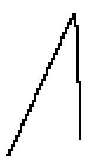


# VBEAT_SINE waveform

## Info

This waveform has been found in the VBeat project. You can find it here: https://github.com/enthusi/VBeat

## Data (Hex) 

```
21-28-2F-33-38-3C-3D-3E
3F-3E-3D-3C-38-33-2F-28
1F-17-10-0B-06-03-01-00
00-00-01-03-06-0B-10-17
```
## Data (Int) 

```
33-40-47-51-56-60-61-62
63-62-61-60-56-51-47-40
31-23-16-11-06-03-01-00
00-00-01-03-06-11-16-23
```
## Diagram (Low Resolution) 

```
     ########                   
    ##      ##                  
    #        #                  
   ##        ##                 
  ##          ##                
 ##            ##               
 #              #               
##              #               
                ##              
                 #              
                 ##            #
                  ##          ##
                   #          # 
                   ##        ## 
                    ##      ##  
                     ########   
```

## Diagram (Full Resolution) 

```
        ##                      
       ####                     
      ##  ##                    
     ##    ##                   
     #      #                   
     #      #                   
     #      #                   
    ##      ##                  
    #        #                  
    #        #                  
    #        #                  
    #        #                  
   ##        ##                 
   #          #                 
   #          #                 
   #          #                 
  ##          ##                
  #            #                
  #            #                
  #            #                
  #            #                
  #            #                
  #            #                
 ##            ##               
 #              #               
 #              #               
 #              #               
 #              #               
 #              #               
 #              #               
##              #               
                #               
                ##              
                 #              
                 #              
                 #              
                 #              
                 #              
                 #              
                 #              
                 ##            #
                  #            #
                  #            #
                  #            #
                  #            #
                  #            #
                  #            #
                  ##          ##
                   #          # 
                   #          # 
                   #          # 
                   #          # 
                   ##        ## 
                    #        #  
                    #        #  
                    #        #  
                    #        #  
                    ##      ##  
                     #      #   
                     #      #   
                     ##    ##   
                      #    #    
                      ##  ##    
                       ####     
```

## Diagram (Bitmap) 

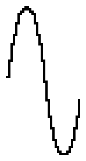


# VBEAT_SQUARE waveform

## Info

This waveform has been found in the VBeat project. You can find it here: https://github.com/enthusi/VBeat

## Data (Hex) 

```
3F-3F-3F-3F-3F-3F-3F-3F
3F-3F-3F-3F-3F-3F-3F-3F
3F-00-00-00-00-00-00-00
00-00-00-00-00-00-00-00
```
## Data (Int) 

```
63-63-63-63-63-63-63-63
63-63-63-63-63-63-63-63
63-00-00-00-00-00-00-00
00-00-00-00-00-00-00-00
```
## Diagram (Low Resolution) 

```
##################              
                 #              
                 #              
                 #              
                 #              
                 #              
                 #              
                 #              
                 #              
                 #              
                 #              
                 #              
                 #              
                 #              
                 #              
                 ###############
```

## Diagram (Full Resolution) 

```
##################              
                 #              
                 #              
                 #              
                 #              
                 #              
                 #              
                 #              
                 #              
                 #              
                 #              
                 #              
                 #              
                 #              
                 #              
                 #              
                 #              
                 #              
                 #              
                 #              
                 #              
                 #              
                 #              
                 #              
                 #              
                 #              
                 #              
                 #              
                 #              
                 #              
                 #              
                 #              
                 #              
                 #              
                 #              
                 #              
                 #              
                 #              
                 #              
                 #              
                 #              
                 #              
                 #              
                 #              
                 #              
                 #              
                 #              
                 #              
                 #              
                 #              
                 #              
                 #              
                 #              
                 #              
                 #              
                 #              
                 #              
                 #              
                 #              
                 #              
                 #              
                 #              
                 #              
                 ###############
```

## Diagram (Bitmap) 


# VBEAT_VIOLIN waveform

## Info

This waveform has been found in the VBeat project. You can find it here: https://github.com/enthusi/VBeat

## Data (Hex) 

```
03-0C-15-16-19-1E-23-23
22-21-21-28-2B-2D-30-36
3C-3C-3A-39-36-32-2E-2A
23-1B-12-0A-05-03-01-00
```
## Data (Int) 

```
03-12-21-22-25-30-35-35
34-33-33-40-43-45-48-54
60-60-58-57-54-50-46-42
35-27-18-10-05-03-01-00
```
## Diagram (Low Resolution) 

```
                ###             
                # ###           
               ##   ##          
              ##     ##         
             ##       ##        
           ###         ##       
           #            #       
      ######            ##      
     ##                  #      
    ##                   ##     
  ###                     #     
  #                       ##    
 ##                        #    
 #                         ##   
 #                          ##  
##                           ###
```

## Diagram (Full Resolution) 

```
                                
                                
                                
                ###             
                # #             
                # ##            
                #  ##           
                #   #           
                #   #           
               ##   ##          
               #     #          
               #     #          
               #     #          
               #     ##         
               #      #         
              ##      #         
              #       #         
              #       ##        
             ##        #        
             #         #        
            ##         #        
            #          ##       
            #           #       
           ##           #       
           #            #       
           #            #       
           #            #       
           #            #       
      ###  #            ##      
      # ## #             #      
      #  ###             #      
      #                  #      
      #                  #      
     ##                  #      
     #                   #      
     #                   #      
     #                   ##     
     #                    #     
    ##                    #     
    #                     #     
    #                     #     
   ##                     #     
  ##                      #     
  #                       #     
  #                       #     
  #                       ##    
  #                        #    
  #                        #    
  #                        #    
  #                        #    
  #                        #    
 ##                        #    
 #                         #    
 #                         ##   
 #                          #   
 #                          #   
 #                          #   
 #                          #   
 #                          ##  
 #                           #  
##                           ## 
                              # 
                              ##
                               #
```

## Diagram (Bitmap) 

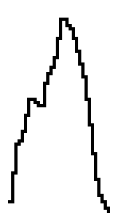


# VBEAT_WARIO waveform

## Info

This waveform has been found in the VBeat project. You can find it here: https://github.com/enthusi/VBeat

## Data (Hex) 

```
00-03-06-0A-0D-10-13-16
1A-1D-20-23-27-2A-2D-24
25-27-28-29-2B-2C-2D-2F
30-32-33-34-36-38-3B-3F
```
## Data (Int) 

```
00-03-06-10-13-16-19-22
26-29-32-35-39-42-45-36
37-39-40-41-43-44-45-47
48-50-51-52-54-56-59-63
```
## Diagram (Low Resolution) 

```
                               #
                             ###
                           ###  
                        ####    
              ##     ####       
             ###  ####          
            ## ####             
          ###                   
         ##                     
        ##                      
       ##                       
     ###                        
    ##                          
   ##                           
  ##                            
###                             
```

## Diagram (Full Resolution) 

```
                               #
                               #
                               #
                               #
                              ##
                              # 
                              # 
                             ## 
                             #  
                            ##  
                            #   
                           ##   
                          ##    
                         ##     
                         #      
                        ##      
                       ##       
                       #        
              ##      ##        
              ##     ##         
              ##    ##          
             ###    #           
             # #   ##           
             # #  ##            
            ## # ##             
            #  # #              
            #  ###              
            #  ##               
           ##                   
           #                    
           #                    
          ##                    
          #                     
          #                     
         ##                     
         #                      
         #                      
        ##                      
        #                       
        #                       
        #                       
       ##                       
       #                        
       #                        
      ##                        
      #                         
      #                         
     ##                         
     #                          
     #                          
    ##                          
    #                           
    #                           
   ##                           
   #                            
   #                            
   #                            
  ##                            
  #                             
  #                             
 ##                             
 #                              
 #                              
##                              
```

## Diagram (Bitmap) 


# VBEAT_WAVE_BASS_GUITAR01 waveform

## Info

This waveform has been found in the VBeat project. You can find it here: https://github.com/enthusi/VBeat

## Data (Hex) 

```
22-31-3E-3F-39-32-2D-2A
29-27-27-26-26-24-23-22
21-21-20-1F-1D-1C-1B-19
15-11-0C-07-04-05-09-11
```
## Data (Int) 

```
34-49-62-63-57-50-45-42
41-39-39-38-38-36-35-34
33-33-32-31-29-28-27-25
21-17-12-07-04-05-09-17
```
## Diagram (Low Resolution) 

```
  ###                           
  # ##                          
  #  #                          
 ##  ##                         
 #    ##                        
 #     ###                      
 #       ######                 
##            ######            
                   ####         
                      ###       
                        ##      
                         ##    #
                          ##   #
                           #  ##
                           #### 
                                
```

## Diagram (Full Resolution) 

```
   ##                           
  ###                           
  # #                           
  # #                           
  # #                           
  # #                           
  # ##                          
  #  #                          
  #  #                          
  #  #                          
  #  #                          
  #  #                          
  #  #                          
  #  ##                         
 ##   #                         
 #    #                         
 #    #                         
 #    #                         
 #    ##                        
 #     #                        
 #     #                        
 #     ##                       
 #      ##                      
 #       #                      
 #       ###                    
 #         ###                  
 #           #                  
 #           ##                 
 #            ##                
##             ##               
                ###             
                  ##            
                   ##           
                    #           
                    ##          
                     ##         
                      ##        
                       #        
                       ##       
                        #       
                        #       
                        #       
                        ##      
                         #      
                         #      
                         #      
                         ##    #
                          #    #
                          #    #
                          #    #
                          #    #
                          ##   #
                           #   #
                           #   #
                           #  ##
                           #  # 
                           ## # 
                            # # 
                            ### 
                            ##  
                                
                                
                                
                                
```

## Diagram (Bitmap) 

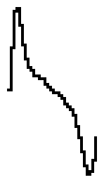


# VBEAT_WAVE_BRASS01 waveform

## Info

This waveform has been found in the VBeat project. You can find it here: https://github.com/enthusi/VBeat

## Data (Hex) 

```
2A-28-1D-29-25-1C-22-23
1B-1A-24-2B-32-30-0C-2A
37-17-28-2B-2A-25-22-1E
18-17-16-16-16-14-00-09
```
## Data (Int) 

```
42-40-29-41-37-28-34-35
27-26-36-43-50-48-12-42
55-23-40-43-42-37-34-30
24-23-22-22-22-20-00-09
```
## Diagram (Low Resolution) 

```
                                
                                
                ##              
            ### ##              
            # # ##              
#####      ## ########          
  ####    ##  ## ##  ##         
  ## #### #   ## ##   ##        
  ## ## # #   ## ##    ##       
        ###   ## ##     ##      
              ## ##      ###### 
              ##              # 
              ##              # 
                              ##
                              ##
                              ##
```

## Diagram (Full Resolution) 

```
                                
                                
                                
                                
                                
                                
                                
                                
                ##              
                ##              
                ##              
                ##              
                ##              
            ##  ##              
            ##  ##              
            ### ##              
            # # ##              
            # # ##              
            # # ##              
            # # ##              
           ## # ## ##           
##         #  #### ###          
 # ##      #  ## # # #          
 ####      #  ## ### #          
  ###      #  ## ##  #          
  ###      #  ## ##  #          
  ####     #  ## ##  ##         
  ## #    ##  ## ##   #         
  ## # ## #   ## ##   #         
  ## #### #   ## ##   ##        
  ## ## # #   ## ##    #        
  ## ## # #   ## ##    #        
  ## ## # #   ## ##    #        
  ## ## # #   ## ##    ##       
  ## ## # #   ## ##     #       
     ## # #   ## ##     #       
        ###   ## ##     #       
         ##   ## ##     #       
              ## ##     #       
              ## ##     ##      
              ## ##      ##     
              ##          ####  
              ##             #  
              ##             ## 
              ##              # 
              ##              # 
              ##              # 
              ##              # 
              ##              # 
              ##              # 
              ##              # 
              ##              # 
                              # 
                              # 
                              ##
                              ##
                              ##
                              ##
                              ##
                              ##
                              ##
                              ##
                              ##
                              ##
```

## Diagram (Bitmap) 

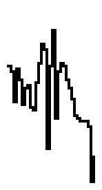


# VBEAT_WAVE_BRASS02 waveform

## Info

This waveform has been found in the VBeat project. You can find it here: https://github.com/enthusi/VBeat

## Data (Hex) 

```
24-3F-30-37-38-34-37-36
34-33-2B-24-25-1F-25-22
27-24-1F-1B-14-11-0C-02
02-05-07-0D-13-17-18-11
```
## Data (Int) 

```
36-63-48-55-56-52-55-54
52-51-43-36-37-31-37-34
39-36-31-27-20-17-12-02
02-05-07-13-19-23-24-17
```
## Diagram (Low Resolution) 

```
 ##                             
 ## ##                          
 #########                      
 ###     ##                     
 #        #                     
 #        ##                    
##         ########             
             #### #             
             ##   ##            
                   ##         ##
                    ##       ###
                     ##     ## #
                      ##   ##   
                       #   #    
                       # ###    
                       ###      
```

## Diagram (Full Resolution) 

```
 ##                             
 ##                             
 ##                             
 ##                             
 ##                             
 ##                             
 ##                             
 ## ##                          
 #######                        
 ### ####                       
 ### ## #                       
 ### ## ##                      
 ###     ##                     
 ###      #                     
 ###      #                     
 ###      #                     
 #        #                     
 #        #                     
 #        #                     
 #        #                     
 #        ##                    
 #         #                    
 #         #                    
 #         #                    
 #         #    ##              
 #         #    ##              
 #         #######              
##         ########             
             #### #             
             #### #             
             ##   #             
             ##   #             
             ##   ##            
                   #            
                   #            
                   #            
                   ##           
                    #           
                    #           
                    #         ##
                    #        ###
                    #        # #
                    #        # #
                    ##       # #
                     #      ## #
                     #      #  #
                     ##     #  #
                      #     #   
                      #     #   
                      #     #   
                      #    ##   
                      ##   #    
                       #   #    
                       #   #    
                       #   #    
                       #   #    
                       #  ##    
                       #  #     
                       # ##     
                       # #      
                       # #      
                       ###      
                                
                                
```

## Diagram (Bitmap) 


# VBEAT_WAVE_FUNKY_GUITAR01 waveform

## Info

This waveform has been found in the VBeat project. You can find it here: https://github.com/enthusi/VBeat

## Data (Hex) 

```
28-2D-0F-1E-36-1A-06-37
2C-00-29-34-08-1B-36-12
11-2D-26-14-26-29-17-21
25-19-26-24-0C-2A-2A-10
```
## Data (Int) 

```
40-45-15-30-54-26-06-55
44-00-41-52-08-27-54-18
17-45-38-20-38-41-23-33
37-25-38-36-12-42-42-16
```
## Diagram (Low Resolution) 

```
                                
                                
    ## ##  ## ##                
    ## ##  ## ##                
 ## ## ### ## ## ##             
### ## # #### ## ##  ##      ###
  # ## # ## # ## ###### ###### #
  # ## # ## # ## # ## ##### ## #
  #### # ## # ## # ## ## ## ## #
  ## ### ## #### # ## ## ## ## #
  ##  ## ## ## # # ## ##    ## #
  ##  ## ## ## ###          ## #
  ##  ## ## ##              ##  
      ## ## ##                  
      ## ##                     
         ##                     
```

## Diagram (Full Resolution) 

```
                                
                                
                                
                                
                                
                                
                                
                                
       ##                       
    ## ##     ##                
    ## ##     ##                
    ## ##  ## ##                
    ## ##  ## ##                
    ## ##  ## ##                
    ## ##  ## ##                
    ## ##  ## ##                
    ## ##  ## ##                
    ## ##  ## ##                
 ## ## ##  ## ## ##             
 ## ## ### ## ## ##             
 ## ## # # ## ## ##             
 ## ## # # ## ## ##          ###
 ## ## # #### ## ##  ##      # #
### ## # ## # ## ##  ##      # #
  # ## # ## # ## ##  ##      # #
  # ## # ## # ## ######   ## # #
  # ## # ## # ## # ## # #### # #
  # ## # ## # ## # ## # ###### #
  # ## # ## # ## # ## # ### ## #
  # ## # ## # ## # ## # ### ## #
  # ## # ## # ## # ## ##### ## #
  # ## # ## # ## # ## ## ## ## #
  # ## # ## # ## # ## ## ## ## #
  #### # ## # ## # ## ## ## ## #
  ## # # ## # ## # ## ## ## ## #
  ## # # ## # ## # ## ## ## ## #
  ## # # ## #### # ## ## ## ## #
  ## ### ## ## # # ## ## ## ## #
  ##  ## ## ## # # ## ## ## ## #
  ##  ## ## ## # # ## ##    ## #
  ##  ## ## ## # # ## ##    ## #
  ##  ## ## ## # # ##       ## #
  ##  ## ## ## # # ##       ## #
  ##  ## ## ## # # ##       ## #
  ##  ## ## ## # #          ## #
  ##  ## ## ## ###          ## #
  ##  ## ## ##  ##          ## #
  ##  ## ## ##              ## #
  ##  ## ## ##              ##  
      ## ## ##              ##  
      ## ## ##              ##  
      ## ## ##              ##  
      ## ## ##                  
      ## ## ##                  
      ## ## ##                  
      ## ## ##                  
      ## ##                     
      ## ##                     
         ##                     
         ##                     
         ##                     
         ##                     
         ##                     
         ##                     
```

## Diagram (Bitmap) 


# VBEAT_WAVE_FUNKY_GUITAR02 waveform

## Info

This waveform has been found in the VBeat project. You can find it here: https://github.com/enthusi/VBeat

## Data (Hex) 

```
26-3A-04-20-3E-00-21-27
18-1F-21-1A-21-20-26-19
1F-38-0B-19-3C-07-1E-36
07-25-2A-1A-12-26-32-0D
```
## Data (Int) 

```
38-58-04-32-62-00-33-39
24-31-33-26-33-32-38-25
31-56-11-25-60-07-30-54
07-37-42-26-18-38-50-13
```
## Diagram (Low Resolution) 

```
    ##              ##          
 ## ##           ## ##          
 ## ##           ## ## ##       
 ## ##           ## ## ##     ##
 ## ##           ## ## ##     ##
 ## ##           ## ## ## ##  ##
### ## ##     ## ## ## ##### ###
  ####### ###### ## ## ### # # #
  ## ## #####  #### ###### # # #
  ## ## ## ##  ## ##### ## ### #
  ## ##           ## ## ##  ## #
  ## ##           ## ## ##  ## #
  ## ##           ## ## ##     #
  ## ##           ## ## ##      
  ## ##              ## ##      
     ##                         
```

## Diagram (Full Resolution) 

```
                                
    ##                          
    ##                          
    ##              ##          
    ##              ##          
 ## ##              ##          
 ## ##              ##          
 ## ##           ## ##          
 ## ##           ## ##          
 ## ##           ## ## ##       
 ## ##           ## ## ##       
 ## ##           ## ## ##       
 ## ##           ## ## ##       
 ## ##           ## ## ##     ##
 ## ##           ## ## ##     ##
 ## ##           ## ## ##     ##
 ## ##           ## ## ##     ##
 ## ##           ## ## ##     ##
 ## ##           ## ## ##     ##
 ## ##           ## ## ##     ##
 ## ##           ## ## ##     ##
 ## ##           ## ## ## ##  ##
 ## ##           ## ## ## ##  ##
 ## ##           ## ## ## ##  ##
 ## ## ##        ## ## ## ##  ##
### ## ##     ## ## ## ## ## ###
  # ## ##     ## ## ## ##### # #
  # ## ##     ## ## ## ### # # #
  # ## ##     ## ## ## ### # # #
  # ## ##     ## ## ## ### # # #
  # ##### ###### ## ## ### # # #
  ##### # ###### ## ## ### # # #
  ## ## #####  #### ## ### # # #
  ## ## ## ##  ## # ###### # # #
  ## ## ## ##  ## # ### ## # # #
  ## ## ## ##  ## # ### ## # # #
  ## ## ## ##  ## # ### ## # # #
  ## ## ## ##  ## # ### ## ### #
  ## ## ##     ## ##### ##  ## #
  ## ## ##        ## ## ##  ## #
  ## ##           ## ## ##  ## #
  ## ##           ## ## ##  ## #
  ## ##           ## ## ##  ## #
  ## ##           ## ## ##  ## #
  ## ##           ## ## ##  ## #
  ## ##           ## ## ##  ## #
  ## ##           ## ## ##     #
  ## ##           ## ## ##     #
  ## ##           ## ## ##     #
  ## ##           ## ## ##     #
  ## ##           ## ## ##     #
  ## ##           ## ## ##      
  ## ##           ## ## ##      
  ## ##              ## ##      
  ## ##              ## ##      
  ## ##              ## ##      
  ## ##              ## ##      
  ## ##                         
  ## ##                         
  ## ##                         
     ##                         
     ##                         
     ##                         
     ##                         
```

## Diagram (Bitmap) 


# VBEAT_WAVE_FUNKY_GUITAR03 waveform

## Info

This waveform has been found in the VBeat project. You can find it here: https://github.com/enthusi/VBeat

## Data (Hex) 

```
20-17-1A-24-34-1B-10-24
11-13-30-2D-2C-1D-15-13
25-19-13-2C-3F-1F-13-27
0D-16-28-26-1D-24-1C-16
```
## Data (Int) 

```
32-23-26-36-52-27-16-36
17-19-48-45-44-29-21-19
37-25-19-44-63-31-19-39
13-22-40-38-29-36-28-22
```
## Diagram (Low Resolution) 

```
                    ##          
                    ##          
    ##              ##          
    ##    ##        ##          
    ##    ####     ###          
    ##    #  #     # #    ##    
   ### ## #  #  ## # # ## ##### 
## # # ## #  #  ## # # ## # ### 
 # # # ## #  ## ## # #### # ####
 ### #### #   # ####  ### #    #
 ##   ### #   ### ##  #####    #
      #####    ## ##  ####      
                        ##      
                                
                                
                                
```

## Diagram (Full Resolution) 

```
                    ##          
                    ##          
                    ##          
                    ##          
                    ##          
                    ##          
                    ##          
                    ##          
                    ##          
                    ##          
                    ##          
    ##              ##          
    ##              ##          
    ##              ##          
    ##              ##          
    ##    ##        ##          
    ##    ##        ##          
    ##    ##        ##          
    ##    ###       ##          
    ##    # ##     ###          
    ##    #  #     # #          
    ##    #  #     # #          
    ##    #  #     # #          
    ##    #  #     # #    ##    
    ##    #  #     # # ## ##    
    ##    #  #     # # ## ###   
    ##    #  #  ## # # ## # #   
   ### ## #  #  ## # # ## # ### 
   # # ## #  #  ## # # ## # ### 
   # # ## #  #  ## # # ## # ### 
   # # ## #  #  ## # # ## # ### 
## # # ## #  #  ## # # ## # ### 
 # # # ## #  #  ## # #### # ### 
 # # # ## #  #  ## #  ### # ### 
 # # # ## #  ## ## #  ### # ### 
 # # # ## #   # ## #  ### #   ##
 # # #### #   # ## #  ### #    #
 ###  ### #   # ## #  ### #    #
 ##   ### #   # ####  ### #    #
 ##   ### #   # # ##  ### #    #
 ##   ### #   # # ##  ### #    #
      ### #   # # ##  #####    #
      ### #   ### ##  ####      
      ### #    ## ##  ####      
      #####    ## ##  ####      
      ####              ##      
      ####              ##      
      ##                ##      
                        ##      
                        ##      
                        ##      
                                
                                
                                
                                
                                
                                
                                
                                
                                
                                
                                
                                
                                
```

## Diagram (Bitmap) 


# VBEAT_WAVE_FUNKY_GUITAR04 waveform

## Info

This waveform has been found in the VBeat project. You can find it here: https://github.com/enthusi/VBeat

## Data (Hex) 

```
21-2E-3A-3D-3F-3D-36-2F
29-20-22-24-25-22-1B-19
14-15-23-20-1A-14-0E-10
13-20-1E-14-1F-22-1D-1D
```
## Data (Int) 

```
33-46-58-61-63-61-54-47
41-32-34-36-37-34-27-25
20-21-35-32-26-20-14-16
19-32-30-20-31-34-29-29
```
## Diagram (Low Resolution) 

```
   ####                         
  ##  #                         
  #   ##                        
  #    #                        
 ##    ##                       
 #      ##                      
 #       # ###                  
##       ### ##   ###    ##  ## 
              #   # #    #######
              ### # ##   # ##   
                ###  ##  # ##   
                      ####      
                      ##        
                                
                                
                                
```

## Diagram (Full Resolution) 

```
    ##                          
    ##                          
   ####                         
   #  #                         
   #  #                         
  ##  #                         
  #   #                         
  #   #                         
  #   #                         
  #   ##                        
  #    #                        
  #    #                        
  #    #                        
  #    #                        
  #    #                        
  #    #                        
  #    ##                       
 ##     #                       
 #      #                       
 #      #                       
 #      #                       
 #      #                       
 #      ##                      
 #       #                      
 #       #                      
 #       #                      
 #       #  ##                  
 #       # ###                  
 #       # # #    ##            
 #       ### ##   ##         ## 
##       ##   #   ##         ## 
         ##   #   ###    ##  ## 
              #   # #    ## ### 
              #   # #    #### # 
              #   # #    # ## ##
              #   # #    # ##   
              ##  # #    # ##   
               #  # ##   # ##   
               ## #  #   # ##   
                # #  #   # ##   
                # #  #   # ##   
                # #  #   # ##   
                ###  #   # ##   
                ##   ##  # ##   
                      # ##      
                      # #       
                      # #       
                      ###       
                      ##        
                      ##        
                                
                                
                                
                                
                                
                                
                                
                                
                                
                                
                                
                                
                                
                                
```

## Diagram (Bitmap) 

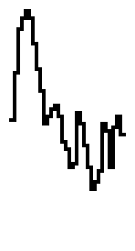


# VBEAT_WAVE_FUNKY_GUITAR05 waveform

## Info

This waveform has been found in the VBeat project. You can find it here: https://github.com/enthusi/VBeat

## Data (Hex) 

```
22-2F-30-27-19-11-1C-31
3F-3E-33-2A-2B-33-37-33
28-21-21-24-27-28-28-25
21-21-21-21-1E-1A-1B-1E
```
## Data (Int) 

```
34-47-48-39-25-17-28-49
63-62-51-42-43-51-55-51
40-33-33-36-39-40-40-37
33-33-33-33-30-26-27-30
```
## Diagram (Low Resolution) 

```
        ###                     
        # #                     
        # #   ##                
  ##   ## ## ####               
 ###   #   # #  #               
 # #   #   ###  ##   ###        
 # ##  #         # ### ##       
##  #  #         ###    #####   
    # ##                    ## #
    ###                      ###
     ##                         
     ##                         
                                
                                
                                
                                
```

## Diagram (Full Resolution) 

```
        ##                      
        ###                     
        # #                     
        # #                     
        # #                     
        # #                     
        # #                     
        # #                     
        # #   ##                
        # #   ##                
        # #   ##                
        # #   ##                
        # ## ####               
        #  # #  #               
       ##  # #  #               
  ##   #   # #  #               
 ###   #   # #  #               
 # #   #   # #  #               
 # #   #   # #  #               
 # #   #   # #  #               
 # #   #   ###  #               
 # #   #   ##   #               
 # #   #        #               
 # #   #        ##   ###        
 # ##  #         #  ## #        
 #  #  #         #  #  #        
 #  #  #         #  #  ##       
 #  #  #         # ##   #       
 #  #  #         # #    #       
##  #  #         # #    #       
    #  #         ###    #####   
    #  #                    #   
    #  #                    #   
    #  #                    ## #
    #  #                     # #
    # ##                     # #
    # #                      ###
    # #                      ## 
    ###                         
     ##                         
     ##                         
     ##                         
     ##                         
     ##                         
     ##                         
     ##                         
     ##                         
                                
                                
                                
                                
                                
                                
                                
                                
                                
                                
                                
                                
                                
                                
                                
                                
                                
```

## Diagram (Bitmap) 


# VBEAT_WAVE_FUNKY_GUITAR06 waveform

## Info

This waveform has been found in the VBeat project. You can find it here: https://github.com/enthusi/VBeat

## Data (Hex) 

```
22-29-0D-0F-16-1A-3A-25
32-2C-01-1A-30-12-25-2F
01-12-1B-26-34-2B-25-1E
20-27-2E-26-13-00-11-10
```
## Data (Int) 

```
34-41-13-15-22-26-58-37
50-44-01-26-48-18-37-47
01-18-27-38-52-43-37-30
32-39-46-38-19-00-17-16
```
## Diagram (Low Resolution) 

```
                                
      ##                        
      ##            ##          
      ####  ##      ##          
      ##### ## ##   ##    ##    
 ##   ### # ## ##   ###   ##    
 ##   ### # #####  ## ## ####   
###   #   # ### #  #   ###  #   
  #   #   # ### #  #   ##   #   
  #  ##   ##### # ##        #   
  # ##    ## ## # #         #   
  # #     ## ## ###         ####
  ###     ##    ##           ## 
          ##    ##           ## 
          ##    ##           ## 
          ##    ##           ## 
```

## Diagram (Full Resolution) 

```
                                
                                
                                
                                
                                
      ##                        
      ##                        
      ##                        
      ##                        
      ##                        
      ##                        
      ##            ##          
      ##            ##          
      ####          ##          
      ####          ##          
      ####  ##      ##          
      ####  ## ##   ##          
      ####  ## ##   ##    ##    
      ####  ## ##   ##    ##    
      ##### ## ##   ##    ##    
      ### # ## ##   ###   ##    
      ### # ## ##   # #   ##    
 ##   ### # ## ##   # #   ##    
 ##   ### # ## ##   # #   ##    
 ##   ### # ## ##   # #  ###    
 ##   ### # ## ##  ## #  # ##   
 ##   ### # #####  #  ## #  #   
 ##   #   # ### #  #   # #  #   
 ##   #   # ### #  #   # #  #   
###   #   # ### #  #   # #  #   
  #   #   # ### #  #   # #  #   
  #   #   # ### #  #   ###  #   
  #   #   # ### #  #   ##   #   
  #   #   # ### #  #   ##   #   
  #   #   # ### #  #        #   
  #   #   # ### #  #        #   
  #   #   # ### # ##        #   
  #  ##   ##### # #         #   
  #  #    ## ## # #         #   
  #  #    ## ## # #         #   
  #  #    ## ## # #         #   
  # ##    ## ## # #         #   
  # #     ## ## # #         #   
  # #     ## ## # #         #   
  # #     ## ## # #         ##  
  # #     ## ## ###          #  
  # #     ##    ##           ###
  # #     ##    ##           ###
  ###     ##    ##           ## 
  ##      ##    ##           ## 
  ##      ##    ##           ## 
          ##    ##           ## 
          ##    ##           ## 
          ##    ##           ## 
          ##    ##           ## 
          ##    ##           ## 
          ##    ##           ## 
          ##    ##           ## 
          ##    ##           ## 
          ##    ##           ## 
          ##    ##           ## 
          ##    ##           ## 
          ##    ##           ## 
                             ## 
```

## Diagram (Bitmap) 

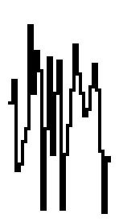


# VBEAT_WAVE_RHODES01 waveform

## Info

This waveform has been found in the VBeat project. You can find it here: https://github.com/enthusi/VBeat

## Data (Hex) 

```
20-23-23-22-21-20-20-22
26-2C-31-36-3A-3C-3C-3A
36-31-2A-23-1C-15-0E-07
03-00-00-03-08-0F-16-1C
```
## Data (Int) 

```
32-35-35-34-33-32-32-34
38-44-49-54-58-60-60-58
54-49-42-35-28-21-14-07
03-00-00-03-08-15-22-28
```
## Diagram (Low Resolution) 

```
             ###                
            ## ##               
           ##   ##              
          ##     ##             
         ##       #             
         #        ##            
        ##         #            
#########          ##           
                    ##         #
                     #         #
                     ##       ##
                      #       # 
                      ##     ## 
                       #    ##  
                       ##   #   
                        #####   
```

## Diagram (Full Resolution) 

```
                                
                                
                                
             ###                
             # #                
            ## ##               
            #   #               
            #   #               
            #   #               
           ##   ##              
           #     #              
           #     #              
           #     #              
           #     #              
          ##     ##             
          #       #             
          #       #             
          #       #             
          #       #             
         ##       #             
         #        #             
         #        ##            
         #         #            
         #         #            
         #         #            
        ##         #            
        #          #            
        #          #            
 ###    #          ##           
 # ##  ##           #           
 #  ## #            #           
##   ###            #           
                    #           
                    #           
                    #           
                    ##         #
                     #         #
                     #         #
                     #         #
                     #         #
                     #         #
                     #        ##
                     ##       # 
                      #       # 
                      #       # 
                      #       # 
                      #       # 
                      #       # 
                      #      ## 
                      ##     #  
                       #     #  
                       #     #  
                       #     #  
                       #     #  
                       #     #  
                       #    ##  
                       ##   #   
                        #   #   
                        #   #   
                        #   #   
                        ## ##   
                         # #    
                         # #    
                         ###    
```

## Diagram (Bitmap) 

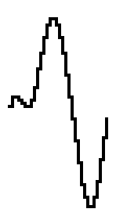


# VBEAT_WAVE_RHODES02 waveform

## Info

This waveform has been found in the VBeat project. You can find it here: https://github.com/enthusi/VBeat

## Data (Hex) 

```
26-35-30-2C-2B-26-21-1E
19-13-10-0F-0E-17-2F-3F
3C-38-36-30-2A-23-1D-18
18-1B-19-13-0C-07-04-0F
```
## Data (Int) 

```
38-53-48-44-43-38-33-30
25-19-16-15-14-23-47-63
60-56-54-48-42-35-29-24
24-27-25-19-12-07-04-15
```
## Diagram (Low Resolution) 

```
               ###              
               # ##             
 ##            #  ##            
 ###           #   ##           
 # ##         ##    #           
 #  ##        #     ##          
##   ##       #      #          
      ##      #      ##         
       ##     #       ##        
        ##    #        #####    
         #   ##            #    
         ### #             ##   
           ###              ## #
                             # #
                             ###
                                
```

## Diagram (Full Resolution) 

```
               ##               
               ##               
               ##               
               ###              
               # #              
               # #              
               # #              
               # ##             
               #  #             
               #  ##            
 ##            #   #            
 ##            #   #            
 ##            #   #            
 ##            #   #            
 ##            #   #            
 ###           #   ##           
 # #          ##    #           
 # #          #     #           
 # #          #     #           
 # ##         #     #           
 #  ##        #     #           
 #   #        #     ##          
 #   #        #      #          
 #   #        #      #          
 #   #        #      #          
##   ##       #      #          
      #       #      #          
      #       #      #          
      #       #      ##         
      #       #       #         
      ##      #       #         
       #      #       #         
       #      #       #         
       ##     #       #         
        #     #       ##        
        #     #        #        
        #     #        # ##     
        #     #        # ##     
        ##    #        # ###    
         #    #        ### #    
         #   ##            #    
         #   #             #    
         #   #             #    
         #   #             #    
         ##  #             ##   
          #  #              #   
          #  #              #   
          ## #              #   
           ###              #  #
            ##              #  #
                            #  #
                            ## #
                             # #
                             # #
                             # #
                             # #
                             ###
                              ##
                              ##
                              ##
                                
                                
                                
                                
```

## Diagram (Bitmap) 


# VBEAT_WAVE_RHODES03 waveform

## Info

This waveform has been found in the VBeat project. You can find it here: https://github.com/enthusi/VBeat

## Data (Hex) 

```
21-27-25-20-1B-16-12-0F
0E-0E-13-1E-2C-39-3F-3F
3A-34-2F-29-23-1D-19-19
1A-1A-17-13-10-0E-0E-15
```
## Data (Int) 

```
33-39-37-32-27-22-18-15
14-14-19-30-44-57-63-63
58-52-47-41-35-29-25-25
26-26-23-19-16-14-14-21
```
## Diagram (Low Resolution) 

```
              ###               
             ## ##              
             #   ##             
             #    #             
            ##    ##            
            #      ##           
 ###        #       #           
## ##       #       ##          
    #      ##        ##         
    ##     #          #####     
     ##    #              ##   #
      ##  ##               ### #
       ####                  ###
                                
                                
                                
```

## Diagram (Full Resolution) 

```
              ###               
              # #               
              # #               
              # #               
              # #               
              # ##              
             ##  #              
             #   #              
             #   #              
             #   #              
             #   #              
             #   ##             
             #    #             
             #    #             
             #    #             
             #    #             
             #    ##            
             #     #            
             #     #            
            ##     #            
            #      #            
            #      #            
            #      ##           
            #       #           
 ##         #       #           
 ##         #       #           
 ###        #       #           
 # #        #       #           
 # #        #       ##          
 # #        #        #          
## #        #        #          
   ##       #        #          
    #       #        #          
    #      ##        #          
    #      #         ##         
    #      #          #         
    ##     #          #         
     #     #          # ###     
     #     #          ### #     
     #     #              #     
     #     #              ##    
     ##    #               #    
      #    #               #   #
      #    #               #   #
      #   ##               ##  #
      ##  #                 #  #
       #  #                 #  #
       #  #                 ## #
       ## #                  # #
        ###                  ###
                                
                                
                                
                                
                                
                                
                                
                                
                                
                                
                                
                                
                                
                                
```

## Diagram (Bitmap) 


# VUE_LINEAR waveform

## Info

This waveform has been found in the VuEngine project. You can find it here: https://github.com/VUEngine

## Data (Hex) 

```
0C-0C-0C-0C-0C-0C-0C-0C
0C-0C-0C-0C-0C-0C-0C-0C
0C-0C-0C-0C-0C-0C-0C-0C
0C-0C-0C-0C-0C-0C-0C-0C
```
## Data (Int) 

```
12-12-12-12-12-12-12-12
12-12-12-12-12-12-12-12
12-12-12-12-12-12-12-12
12-12-12-12-12-12-12-12
```
## Diagram (Low Resolution) 

```
                                
                                
                                
                                
                                
                                
                                
                                
                                
                                
                                
                                
################################
                                
                                
                                
```

## Diagram (Full Resolution) 

```
                                
                                
                                
                                
                                
                                
                                
                                
                                
                                
                                
                                
                                
                                
                                
                                
                                
                                
                                
                                
                                
                                
                                
                                
                                
                                
                                
                                
                                
                                
                                
                                
                                
                                
                                
                                
                                
                                
                                
                                
                                
                                
                                
                                
                                
                                
                                
                                
                                
                                
                                
################################
                                
                                
                                
                                
                                
                                
                                
                                
                                
                                
                                
                                
```

## Diagram (Bitmap) 


# VUE_SINE waveform

## Info

This waveform has been found in the VuEngine project. You can find it here: https://github.com/VUEngine

## Data (Hex) 

```
1F-25-2B-30-35-39-3C-3E
3E-3E-3C-39-35-30-2B-25
1F-19-13-0E-09-05-02-00
00-00-02-05-09-0E-13-19
```
## Data (Int) 

```
31-37-43-48-53-57-60-62
62-62-60-57-53-48-43-37
31-25-19-14-09-05-02-00
00-00-02-05-09-14-19-25
```
## Diagram (Low Resolution) 

```
      ######                    
     ##    ##                   
    ##      ##                  
   ##        ##                 
   #          #                 
  ##          ##                
 ##            ##               
 #              #               
##              ##              
                 ##            #
                  #            #
                  ##          ##
                   ##        ## 
                    ##      ##  
                     ##    ##   
                      ######    
```

## Diagram (Full Resolution) 

```
                                
       ####                     
       #  #                     
      ##  ##                    
      #    #                    
      #    #                    
     ##    ##                   
     #      #                   
     #      #                   
     #      #                   
    ##      ##                  
    #        #                  
    #        #                  
    #        #                  
    #        #                  
   ##        ##                 
   #          #                 
   #          #                 
   #          #                 
   #          #                 
  ##          ##                
  #            #                
  #            #                
  #            #                
  #            #                
  #            #                
 ##            ##               
 #              #               
 #              #               
 #              #               
 #              #               
 #              #               
##              ##              
                 #              
                 #              
                 #              
                 #              
                 #              
                 ##            #
                  #            #
                  #            #
                  #            #
                  #            #
                  #            #
                  ##          ##
                   #          # 
                   #          # 
                   #          # 
                   #          # 
                   ##        ## 
                    #        #  
                    #        #  
                    #        #  
                    #        #  
                    ##      ##  
                     #      #   
                     #      #   
                     #      #   
                     ##    ##   
                      #    #    
                      #    #    
                      ##  ##    
                       #  #     
                       ####     
```

## Diagram (Bitmap) 


