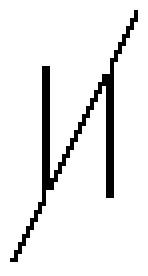

# BH_SAW waveform

## Info

This waveform has been extracted from the game Bound High!. You can find infos here: https://www.virtual-boy.com/games/bound-high/

## Data (Hex) 

```
01-03-05-07-09-0B-0D-0F
31-13-15-17-19-1B-1D-1F
21-23-25-27-29-2B-2D-2F
11-33-35-37-39-3B-3D-3F
```
## Data (Int) 

```
01-03-05-07-09-11-13-15
49-19-21-23-25-27-29-31
33-35-37-39-41-43-45-47
17-51-53-55-57-59-61-63
```
## Diagram (Low Resolution) 

```
###                             
  ###                           
    ###                         
      ###                       
        ###             ##      
        #####           ##      
        ##  ###         ##      
        ##    ###       ##      
        ##      ###     ##      
        ##        ###   ##      
        ##          ### ##      
        ##            ####      
        ##               ##     
                          ###   
                            ### 
                              ##
```

## Diagram (Full Resolution) 

```
                                
##                              
 #                              
 ##                             
  #                             
  ##                            
   #                            
   ##                           
    #                           
    ##                          
     #                          
     ##                         
      #                         
      ##                        
       #                        
       ##                       
        #                       
        #               ##      
        #               ##      
        ###             ##      
        ###             ##      
        ####            ##      
        ## #            ##      
        ## ##           ##      
        ##  #           ##      
        ##  ##          ##      
        ##   #          ##      
        ##   ##         ##      
        ##    #         ##      
        ##    ##        ##      
        ##     #        ##      
        ##     ##       ##      
        ##      #       ##      
        ##      ##      ##      
        ##       #      ##      
        ##       ##     ##      
        ##        #     ##      
        ##        ##    ##      
        ##         #    ##      
        ##         ##   ##      
        ##          #   ##      
        ##          ##  ##      
        ##           #  ##      
        ##           ## ##      
        ##            # ##      
        ##            ####      
        ##             ###      
        ##             ###      
        ##               #      
        ##               #      
                         #      
                         ##     
                          #     
                          ##    
                           #    
                           ##   
                            #   
                            ##  
                             #  
                             ## 
                              # 
                              ##
                               #
                               #
```

## Diagram (Bitmap) 


