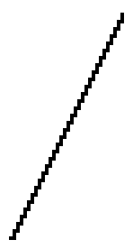

# GCCVB_SAWTOOTH waveform

## Info

This waveform has been found in libgccvb. You can find it here: https://github.com/VUEngine/libgccvb

## Data (Hex) 

```
00-02-04-06-08-0A-0C-0E
10-12-14-16-18-1A-1C-1E
20-22-24-26-28-2A-2C-2E
30-32-34-36-38-3A-3C-3E
```
## Data (Int) 

```
00-02-04-06-08-10-12-14
16-18-20-22-24-26-28-30
32-34-36-38-40-42-44-46
48-50-52-54-56-58-60-62
```
## Diagram (Low Resolution) 

```
###                             
  ###                           
    ###                         
      ###                       
        ###                     
          ###                   
            ###                 
              ###               
                ###             
                  ###           
                    ###         
                      ###       
                        ###     
                          ###   
                            ### 
                              ##
```

## Diagram (Full Resolution) 

```
##                              
 #                              
 ##                             
  #                             
  ##                            
   #                            
   ##                           
    #                           
    ##                          
     #                          
     ##                         
      #                         
      ##                        
       #                        
       ##                       
        #                       
        ##                      
         #                      
         ##                     
          #                     
          ##                    
           #                    
           ##                   
            #                   
            ##                  
             #                  
             ##                 
              #                 
              ##                
               #                
               ##               
                #               
                ##              
                 #              
                 ##             
                  #             
                  ##            
                   #            
                   ##           
                    #           
                    ##          
                     #          
                     ##         
                      #         
                      ##        
                       #        
                       ##       
                        #       
                        ##      
                         #      
                         ##     
                          #     
                          ##    
                           #    
                           ##   
                            #   
                            ##  
                             #  
                             ## 
                              # 
                              ##
                               #
                               #
                                
```

## Diagram (Bitmap) 


