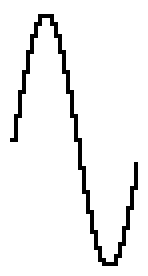

# GCCVB_SINE waveform

## Info

This waveform has been found in libgccvb. You can find it here: https://github.com/VUEngine/libgccvb

## Data (Hex) 

```
1F-25-2B-30-35-39-3C-3E
3E-3E-3C-39-35-30-2B-25
1F-18-12-0D-08-04-01-00
00-00-02-05-09-0E-13-19
```
## Data (Int) 

```
31-37-43-48-53-57-60-62
62-62-60-57-53-48-43-37
31-24-18-13-08-04-01-00
00-00-02-05-09-14-19-25
```
## Diagram (Low Resolution) 

```
      ######                    
     ##    ##                   
    ##      ##                  
   ##        ##                 
   #          #                 
  ##          ##                
 ##            ##               
 #              #               
##              ##              
                 ##            #
                  #            #
                  ##          ##
                   ##        ## 
                    ##      ##  
                     ##    ##   
                      ######    
```

## Diagram (Full Resolution) 

```
                                
       ####                     
       #  #                     
      ##  ##                    
      #    #                    
      #    #                    
     ##    ##                   
     #      #                   
     #      #                   
     #      #                   
    ##      ##                  
    #        #                  
    #        #                  
    #        #                  
    #        #                  
   ##        ##                 
   #          #                 
   #          #                 
   #          #                 
   #          #                 
  ##          ##                
  #            #                
  #            #                
  #            #                
  #            #                
  #            #                
 ##            ##               
 #              #               
 #              #               
 #              #               
 #              #               
 #              #               
##              ##              
                 #              
                 #              
                 #              
                 #              
                 #              
                 #             #
                 ##            #
                  #            #
                  #            #
                  #            #
                  #            #
                  #           ##
                  ##          # 
                   #          # 
                   #          # 
                   #          # 
                   #         ## 
                   ##        #  
                    #        #  
                    #        #  
                    #        #  
                    #       ##  
                    ##      #   
                     #      #   
                     #      #   
                     #     ##   
                     ##    #    
                      #    #    
                      #   ##    
                      ##  #     
                       ####     
```

## Diagram (Bitmap) 


