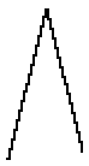

# GCCVB_TRIANGLE waveform

## Info

This waveform has been found in libgccvb. You can find it here: https://github.com/VUEngine/libgccvb

## Data (Hex) 

```
00-04-08-0C-10-14-18-1C
1F-23-27-2B-2F-33-37-3B
3E-3A-36-32-2E-2A-26-22
1F-1B-17-13-0F-0B-07-03
```
## Data (Int) 

```
00-04-08-12-16-20-24-28
31-35-39-43-47-51-55-59
62-58-54-50-46-42-38-34
31-27-23-19-15-11-07-03
```
## Diagram (Low Resolution) 

```
##                             #
 ##                           ##
  ##                         ## 
   ##                       ##  
    ##                     ##   
     ##                   ##    
      ##                 ##     
       ###              ##      
         ##            ##       
          ##          ##        
           ##        ##         
            ##      ##          
             ##    ##           
              ##  ##            
               ####             
                ##              
```

## Diagram (Full Resolution) 

```
##                              
 #                              
 #                              
 #                             #
 ##                            #
  #                            #
  #                            #
  #                           ##
  ##                          # 
   #                          # 
   #                          # 
   #                         ## 
   ##                        #  
    #                        #  
    #                        #  
    #                       ##  
    ##                      #   
     #                      #   
     #                      #   
     #                     ##   
     ##                    #    
      #                    #    
      #                    #    
      #                   ##    
      ##                  #     
       #                  #     
       #                  #     
       #                 ##     
       ##                #      
        #                #      
        #                #      
        ##              ##      
         #              #       
         #              #       
         #             ##       
         ##            #        
          #            #        
          #            #        
          #           ##        
          ##          #         
           #          #         
           #          #         
           #         ##         
           ##        #          
            #        #          
            #        #          
            #       ##          
            ##      #           
             #      #           
             #      #           
             #     ##           
             ##    #            
              #    #            
              #    #            
              #   ##            
              ##  #             
               #  #             
               #  #             
               # ##             
               ###              
                ##              
                ##              
                ##              
                                
```

## Diagram (Bitmap) 


