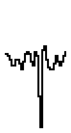

# GCCVB_TRUMPET waveform

## Info

This waveform has been found in libgccvb. You can find it here: https://github.com/VUEngine/libgccvb

## Data (Hex) 

```
26-25-23-20-20-23-23-21
1E-22-26-27-26-22-20-27
25-10-00-28-2A-23-1F-1E
1E-21-25-22-20-22-25-27
```
## Data (Int) 

```
38-37-35-32-32-35-35-33
30-34-38-39-38-34-32-39
37-16-00-40-42-35-31-30
30-33-37-34-32-34-37-39
```
## Diagram (Low Resolution) 

```
                  ##            
                  ##            
                  ##            
                  ##            
                 ###            
                 # #            
                 # #            
        ##       # #  ####      
  #########  ### # # ##  ###### 
###       #### ### # #    ##  ##
                   ###          
                                
                                
                                
                                
                                
```

## Diagram (Full Resolution) 

```
                  ##            
                  ##            
                  ##            
                  ##            
                  ##            
                  ##            
                  ##            
                  ##            
                  ##            
                  ##            
                  ##            
                  ##            
                  ##            
                  ##            
                  ##            
                  ##            
                 ###            
                 # #            
                 # #            
                 # #            
                 # #            
                 # #            
                 # #            
                 # #            
                 # #            
                 # #            
                 # #            
                 # #            
                 # #            
                 # #            
        ##       # #   ###      
        ##       # #  ## #      
   ###  ##    ## # #  #  #  ##  
   # # ###    ## # #  #  ## ##  
   # # # ##  ### # #  #   ##### 
  ## ###  #  # # # # ##   ##  # 
  #       #  # # # # #    ##  # 
 ##       #  # ### # #    ##  ##
##        #### ##  # #         #
           ##  ##  # #         #
                   ###          
                    ##          
                    ##          
                                
                                
                                
                                
                                
                                
                                
                                
                                
                                
                                
                                
                                
                                
                                
                                
                                
                                
                                
                                
                                
```

## Diagram (Bitmap) 


