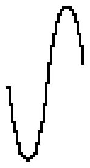

# VBEAT_SINE waveform

## Info

This waveform has been found in the VBeat project. You can find it here: https://github.com/enthusi/VBeat

## Data (Hex) 

```
21-28-2F-33-38-3C-3D-3E
3F-3E-3D-3C-38-33-2F-28
1F-17-10-0B-06-03-01-00
00-00-01-03-06-0B-10-17
```
## Data (Int) 

```
33-40-47-51-56-60-61-62
63-62-61-60-56-51-47-40
31-23-16-11-06-03-01-00
00-00-01-03-06-11-16-23
```
## Diagram (Low Resolution) 

```
     ########                   
    ##      ##                  
    #        #                  
   ##        ##                 
  ##          ##                
 ##            ##               
 #              #               
##              #               
                ##              
                 #              
                 ##            #
                  ##          ##
                   #          # 
                   ##        ## 
                    ##      ##  
                     ########   
```

## Diagram (Full Resolution) 

```
        ##                      
       ####                     
      ##  ##                    
     ##    ##                   
     #      #                   
     #      #                   
     #      #                   
    ##      ##                  
    #        #                  
    #        #                  
    #        #                  
    #        #                  
   ##        ##                 
   #          #                 
   #          #                 
   #          #                 
  ##          ##                
  #            #                
  #            #                
  #            #                
  #            #                
  #            #                
  #            #                
 ##            ##               
 #              #               
 #              #               
 #              #               
 #              #               
 #              #               
 #              #               
##              #               
                #               
                ##              
                 #              
                 #              
                 #              
                 #              
                 #              
                 #              
                 #              
                 ##            #
                  #            #
                  #            #
                  #            #
                  #            #
                  #            #
                  #            #
                  ##          ##
                   #          # 
                   #          # 
                   #          # 
                   #          # 
                   ##        ## 
                    #        #  
                    #        #  
                    #        #  
                    #        #  
                    ##      ##  
                     #      #   
                     #      #   
                     ##    ##   
                      #    #    
                      ##  ##    
                       ####     
```

## Diagram (Bitmap) 


