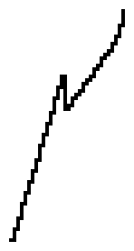

# VBEAT_WARIO waveform

## Info

This waveform has been found in the VBeat project. You can find it here: https://github.com/enthusi/VBeat

## Data (Hex) 

```
00-03-06-0A-0D-10-13-16
1A-1D-20-23-27-2A-2D-24
25-27-28-29-2B-2C-2D-2F
30-32-33-34-36-38-3B-3F
```
## Data (Int) 

```
00-03-06-10-13-16-19-22
26-29-32-35-39-42-45-36
37-39-40-41-43-44-45-47
48-50-51-52-54-56-59-63
```
## Diagram (Low Resolution) 

```
                               #
                             ###
                           ###  
                        ####    
              ##     ####       
             ###  ####          
            ## ####             
          ###                   
         ##                     
        ##                      
       ##                       
     ###                        
    ##                          
   ##                           
  ##                            
###                             
```

## Diagram (Full Resolution) 

```
                               #
                               #
                               #
                               #
                              ##
                              # 
                              # 
                             ## 
                             #  
                            ##  
                            #   
                           ##   
                          ##    
                         ##     
                         #      
                        ##      
                       ##       
                       #        
              ##      ##        
              ##     ##         
              ##    ##          
             ###    #           
             # #   ##           
             # #  ##            
            ## # ##             
            #  # #              
            #  ###              
            #  ##               
           ##                   
           #                    
           #                    
          ##                    
          #                     
          #                     
         ##                     
         #                      
         #                      
        ##                      
        #                       
        #                       
        #                       
       ##                       
       #                        
       #                        
      ##                        
      #                         
      #                         
     ##                         
     #                          
     #                          
    ##                          
    #                           
    #                           
   ##                           
   #                            
   #                            
   #                            
  ##                            
  #                             
  #                             
 ##                             
 #                              
 #                              
##                              
```

## Diagram (Bitmap) 


