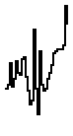

# VBEAT_WAVE_BRASS01 waveform

## Info

This waveform has been found in the VBeat project. You can find it here: https://github.com/enthusi/VBeat

## Data (Hex) 

```
2A-28-1D-29-25-1C-22-23
1B-1A-24-2B-32-30-0C-2A
37-17-28-2B-2A-25-22-1E
18-17-16-16-16-14-00-09
```
## Data (Int) 

```
42-40-29-41-37-28-34-35
27-26-36-43-50-48-12-42
55-23-40-43-42-37-34-30
24-23-22-22-22-20-00-09
```
## Diagram (Low Resolution) 

```
                                
                                
                ##              
            ### ##              
            # # ##              
#####      ## ########          
  ####    ##  ## ##  ##         
  ## #### #   ## ##   ##        
  ## ## # #   ## ##    ##       
        ###   ## ##     ##      
              ## ##      ###### 
              ##              # 
              ##              # 
                              ##
                              ##
                              ##
```

## Diagram (Full Resolution) 

```
                                
                                
                                
                                
                                
                                
                                
                                
                ##              
                ##              
                ##              
                ##              
                ##              
            ##  ##              
            ##  ##              
            ### ##              
            # # ##              
            # # ##              
            # # ##              
            # # ##              
           ## # ## ##           
##         #  #### ###          
 # ##      #  ## # # #          
 ####      #  ## ### #          
  ###      #  ## ##  #          
  ###      #  ## ##  #          
  ####     #  ## ##  ##         
  ## #    ##  ## ##   #         
  ## # ## #   ## ##   #         
  ## #### #   ## ##   ##        
  ## ## # #   ## ##    #        
  ## ## # #   ## ##    #        
  ## ## # #   ## ##    #        
  ## ## # #   ## ##    ##       
  ## ## # #   ## ##     #       
     ## # #   ## ##     #       
        ###   ## ##     #       
         ##   ## ##     #       
              ## ##     #       
              ## ##     ##      
              ## ##      ##     
              ##          ####  
              ##             #  
              ##             ## 
              ##              # 
              ##              # 
              ##              # 
              ##              # 
              ##              # 
              ##              # 
              ##              # 
              ##              # 
                              # 
                              # 
                              ##
                              ##
                              ##
                              ##
                              ##
                              ##
                              ##
                              ##
                              ##
                              ##
```

## Diagram (Bitmap) 


